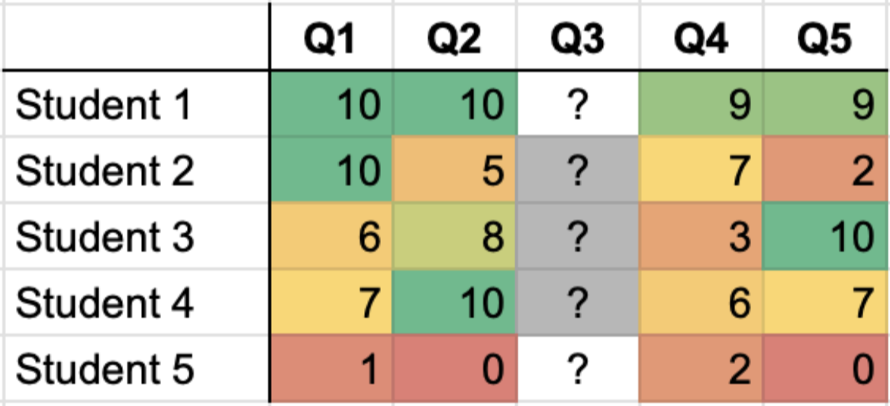

# Vision of fully automated solution

In our vision, generative AI models create a fully automated solution to test 1 and 2. Human evaluators continue to process a small part (5%) of answers to create the golden standard grades used in tuning AI grading and evaluating alternative AI models. Also a small part of assignment gradings can be challenged by students who believe that the automatic system provided incorrect grades; these assignments also go to the human evaluators.

# Solution

Solution handles several practical business questions not covered by the vision:

- available AI models cannot reach required precision in **all** questions
- prompt tuning for complex questions takes significant time even when it is possible

Keeping the vision of a fully automated AI system, the solution starts with parts of evaluation job that can be fully automated now with the sufficient precision. It continues to grow the fully automated part of work by improving AI methods via prompt tuning and tweaking the test formulations, until all the work would be automated in the future. Meanwhile, the manual part of grading is done by human experts but it takes less time because of the reduced amount of work.

## Two dimensions of automatic evaluation

The evaluation workload is split into automatic/manual parts in two dimensions: by questions and by students. Imagine a hypothetical example on the figure below.

1. AI system can evaluate all questions except Q3 with sufficient precision. It still produces grades for Q3 but they are less reliable. Human evaluators only need to grade question 3.
2. Student 1 received very high grades in questions 1,2,4,5 reliably evaluated by AI. This student passes the test automatically without even grading the remaining question 3. Likewise, student 5 received all low grades in automatically evaluated questions and fails the test automatically without evaluating question 3.

The remaining manual work consists of grading question 3 for students 2,3,4 whose pass of failing depends on the outcomes of manual grading, and cannot be predicted with AI from the available data with enough precision.

**Important:**  The decisions of which questions to grade with AI and which students to pass/fail with AI are computed on the existing dataset of 120,000 certifications. These are valid for only one AI model, and need to be re-adjusted for different models and different model settings.

## Long term strategy

In the long term, improvements in AI models, model usage by Certifiable Inc, and changes to test formulation should lead to the manual part of grading completely disappearing. Human role would consist in providing gradings for AI model tuning, creating new questions and the initial gradings for these questions until the performance of AI could be proven sufficient.
