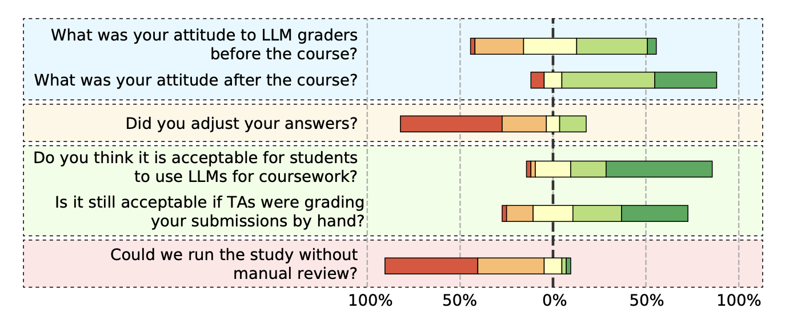

# Test 1

The role of the first test is to validate that a candidate is familiar with the core concepts of software architecture. This is evident from the fact that a passed test counts towards the next certification attempts. The test has two parts: the multiple choice questions are evaluated automatically, and the short answer questions are evaluated manually with a 1 week response time, taking on average 3 hours of work.

## Proposed Automatic solution to Test 1

We aim to develop a fully automatic solution for grading the short answer questions with AI. Together with the existing automatic grading of multiple choice questions, it will cover the whole test 1 and solve the scaling challenge of Certifiable Inc. Human experts will continue to manually grade a small part of answers (~5%) to create the "ground truth" data for tuning AI models. Also new questions would need the initial manual gradings to ensure the AI performance meets the necessary standards.

The fully automatic evaluation goal is challenging, and would not be achieved at the initial deployment. Instead, the grading work is split between AI and human evaluators in a way that ensures the required high quality standard. Over time the AI share of evaluations will grow until it reaches 100% at the same high standards.

We propose three ways of splitting the workload from human evaluators to AI:

1. Certifiable Inc. has a large dataset of 120,000 graded past assignments. AI model performance is evaluated on each short answer question of Test 1 separately. Questions where the AI model reaches necessary grading performance are automated. As AI models improve or our prompt engineering system improves, more questions could be transferred to AI.
2. AI may get poor performance on specific questions because of the way they are formulated, vague evaluation criteria, or very broad acceptable answers. Some questions can be re-formulated or directly replaced to make them "AI friendly" and transfer their grading to AI.
3. Even from partial gradings, it is possible to deduct a reliable pass/fail decision for some candidates using an ML model trained and validated on the historical data. Candidates with automatic decision need no manual gradings at all.

See [automatic solution](./automatic-solution.md) for details.

## Alternative human-in-the-loop solution to Test 1

As Certifiable Inc. values its reputation and the quality of its assessments, we propose to keep a human evaluation in the loop for test 1. An AI system can do preliminary grading of the open questions to the test, and generate an automated grading summary with proposed scores and its confidence in the score. Additionally, the model will write a summary of its gradings that can be shared with the students as a feedback.

The human evaluator will double-check the model suggestions for some of the questions in the automatic grading sheet. In uncertain cases, all questions can be checked manually. Automatic feedback can also help a human evaluator with scoring, potentially highlighting the missing or incorrect parts in the answer.

Another motivation for keeping a human in the loop is a general negative view on being evaluated by a fully automated system:

Students are generally positive towards LLM grading, as long as there is a human reviewer involved. Figure from a [recent paper on a mixed human+AI assignment grading in a biology course](../references.md#llm-acceptance).

Summary of the solution features:

- AI creates an automatic grading sheet, providing for each question: 
    * numeric score
    * confidence in this score
    * feedback to the answer
- evaluation system uses cheaper self-hosted LLM models for automatic assessment because the task of evaluating one question is rather simple
- evaluation system includes guardrails with an extra LLM evaluating whether an answer includes instructions to LLM or re-defines a question

Solution properties:

- reduces an average amount of manual work needed for grading an assignment

## Alternative fully automated solution to test 1

An alternative vision of an effective AI solution for test 1 works differently from the existing flow, while achieving the same goal of validating the candidate's knowledge of the core software architecture concepts. The test is opened continuously for 30 days and can be taken any number of times. Test evaluation is fully automatic using the existing system for multiple choice questions and an AI judge for the short answer questions, available in near real time (a few minutes). An applicant passes the test once they achieved a high (but not perfect) score at least 3 times, and need to do so within the 30 days to continue to the second test. Every test attempt displays the feedback with scores per question, and a brief summary of why their answer is wrong for each failed question. The test uses multiple versions of the same question formulated in a different way to avoid cheating by memorization; AI helps creating multiple versions of the questions (with human validation).

Summary of the solution features:

- test 1 available for 30 days with unlimited attempts
- test 1 is passed after 3 attempts with a very high (but not perfect) score
- evaluation is fully automatic, done in near real time
- evaluation system provides hints about wrong answers, e.g. a summary of what was wrong or a suggestion to study a specific topic
- evaluation system uses cheap smaller LLM models for automatic assessment because the task of evaluating one question is rather simple
- multiple question versions avoid cheating by making it easier to really learn the concepts instead of memorizing the answers

Solution properties:

- the cost is negligible compared to manual evaluation, because the test uses simpler AI models for the short answer questions
- instant feedback avoids the 1-week evaluation time, improving the user experience
- multiple test attempts help candidates learn the core concepts
- (optional) failing test 1 costs a participant less than $800 improving the user experience
- removing 3h of manual evaluation work helps scaling and improves the margins of Certifiable Inc.
