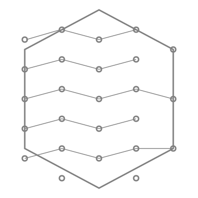

  
  <h1>Project <strong>SoftArchCert</strong> by Team <strong>Deep Archs</strong></h1>
  
<i></i>

  <b>O'Reilly Architectural Kata: Winter 2025</b>  

 

Hi there! 👋 We are team <b title="Deep Archs">Deep Archs</b> and we are glad to present our solution to the announced Kata!

## 📖 Table of Contents

- [Overview](1.Overview/readme.md)
- [Business Goals](2.Business-goals/readme.md)
- [Drivers & Requirements](3.Requirements/readme.md)
- [Problem Background](4.Problem-background/readme.md)
- [Proposed Solution](5.Proposed-solution/readme.md)
- [Diagrams](6.Diagrams/readme.md)
- [Architectural Decision Records (ADRs)](7.ADRs/readme.md)
- [Implementation Details](8.Implementation-details/readme.md)
- [Conclusion](9.Conclusion/readme.md)
- [Glossary](glossary.md)
- [References](references.md)

# Team ✨

- [Ivan Georgiev](https://www.linkedin.com/in/ivan-georgiev-859b219/)
- [Anton Akusok](https://fi.linkedin.com/in/antonakusok)
- [Soumik Das](https://www.linkedin.com/in/soumikdas22)
